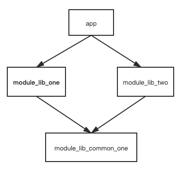

# Gradle依赖之‘五种依赖配置’


# AndroidxDemo

###
目前gradle支持的依赖配置有五种，分别是implementation,api,compileOnly,runtimeOnly和annotationProcessor。常用的依赖配置是implementation, api和compileOnly。



####
第一种：implementation    类似private
会将指定的依赖添加到编译路径，并且会将该依赖打包到输出，如apk中，但是这个依赖在编译时不能暴露给其他模块，例如依赖此模块的其他模块。这种方式指定的依赖在编译时只能在当前模块中访问。

*只能传递一层，两层结构的话用implementation 和api没区别
####
第二种：api       
使用api配置的依赖会将对应的依赖添加到编译路径，并将依赖打包输出，但是这个依赖是可以传递的，比如模块A依赖模块B，B依赖库C，模块B在编译时能够访问到库C，但是与implemetation不同的是，在模块A中库C也是可以访问的。

*类似pulice，可以单向透传，适用于三层以上（包含）的项目结构,api是单向依赖透传，上图中依赖结构的项目，app模块中的cardview不能透传到下层模块中module_lib_one/module_lib_common_one
####
第三种：compileOnly  
compileOnly修饰的依赖会添加到编译路径中，但是不会打包到apk中，因此只能在编译时访问，且compileOnly修饰的依赖不会传递。


所有module都用到cardview如何依赖：

app:
```Java
api project(path: ':module_lib_one')
api project(path: ':module_lib_two')
```

module_lib_one :（只要其他模块cardview参与打包了就可以）
```Java
compileOnly project(path: ':module_lib_common_one')
或
api project(path: ':module_lib_common_one')
或
implementation project(path: ':module_lib_common_one')
```

module_ib_two:
```
api project(path: ':module_lib_common_one')
```

module_lib_common_one:
```
api 'com.android.support:cardview-v7:29+'
```


使用场景：
用于解决依赖冲突，一个父模块+两个子模块：
-----
两层结构：子模块都依赖cardview,子模块module_lib_one和module_lib_two中只要有一个使用implementation或api依赖cardview就会打包到apk中，其他模块都可以使用compileOnly，这样实际代码都可以使用cardview的api,实际测试包大小没有差别；
-----
三层结构：还可以让两个子模块都依赖一个根模块module_llib_common_one，根模块中使用api依赖透传，这样三个子模块甚至不用添加cardview依赖操作。
-----
####
第四种：runtimeOnly
这个与compileOnly相反，它修饰的依赖不会添加到编译路径中，但是被打包到apk中，运行时使用。
####
第五种：annotationProcessor
用于注解处理器的依赖配置，还没有使用过。
除了上面五种，还有两种testImplementation和androidTestImplementation两种，用于指定在测试代码的依赖。


